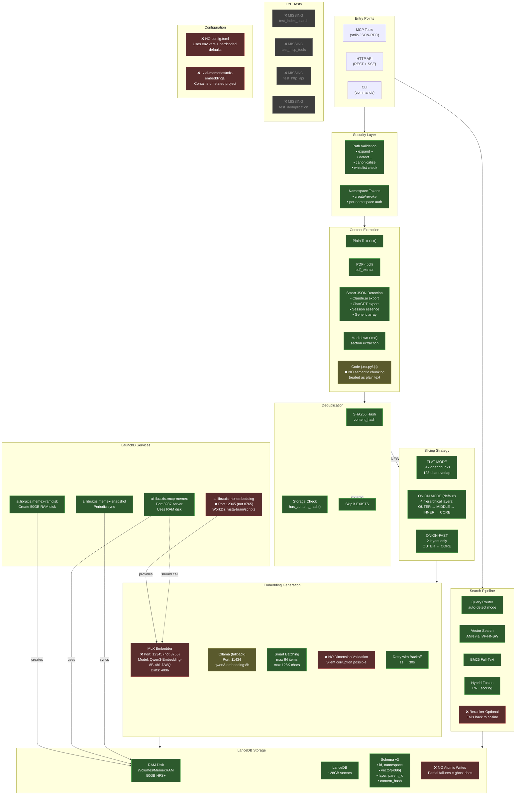

# Memex Architecture - ACTUAL (Stan Faktyczny)



## Status: Co działa, co nie

### ✅ DZIAŁA (zielone)
| Komponent | Status | Uwagi |
|-----------|--------|-------|
| Path Validation | ✅ | Pełna walidacja traversal |
| Namespace Tokens | ✅ | create/revoke/verify |
| Plain Text extraction | ✅ | UTF-8 read |
| PDF extraction | ✅ | pdf_extract crate |
| Smart JSON detection | ✅ | Claude/ChatGPT/Session |
| Markdown extraction | ✅ | Section-aware |
| Deduplication | ✅ | SHA256 + storage check |
| Flat/Onion/Fast slicing | ✅ | Wszystkie 3 tryby |
| Smart Batching | ✅ | 64 items / 128K chars |
| Retry with Backoff | ✅ | 1s → 30s |
| RAM Disk | ✅ | 50GB /Volumes/MemexRAM |
| LanceDB | ✅ | 28GB, schema v3 |
| Query Router | ✅ | auto-detect |
| Vector/BM25/Hybrid search | ✅ | Wszystkie tryby |
| LaunchD services | ✅ | ramdisk, memex, snapshot |

### ❌ NIE DZIAŁA / NIE SPIĘTE (czerwone)
| Komponent | Problem | Impact |
|-----------|---------|--------|
| **MLX Port w kodzie** | Kod domyślnie 12345, serwer na **8765** | Config mismatch |
| **Atomic Writes** | BRAK - ghost docs przy crash | **HIGH** |
| **Reranker** | Optional, fallback to cosine | Słabsze wyniki |
| **config.toml** | BRAK - hardcoded defaults | Trudne zarządzanie |

### ✅ NAPRAWIONE (w tej sesji)
| Komponent | Status | Uwagi |
|-----------|--------|-------|
| **Dimension Validation** | ✅ DODANE | `test_dimension()` w `EmbeddingClient::new()` |
| **E2E Tests** | ✅ DODANE | `tests/e2e_pipeline.rs` - 5 testów |
| **TextIntegrityMetrics** | ✅ DODANE | >90% threshold, audit command |
| **DimensionAdapter** | ✅ DODANE | Cross-dim search 1024/2048/4096 |
| **Audit/Purge commands** | ✅ DODANE | `rust-memex audit`, `purge-quality` |

### ⚠️ CZĘŚCIOWE (żółte)
| Komponent | Status | Uwagi |
|-----------|--------|-------|
| Code extraction | ⚠️ | Traktowane jako plain text, brak AST |
| Ollama | ⚠️ | Działa jako fallback, ale to nie docelowy design |

### ❌ CAŁKOWICIE BRAKUJE (szare)
| Komponent | Status |
|-----------|--------|
| E2E test: index → search | ❌ BRAK |
| E2E test: MCP tools | ❌ BRAK |
| E2E test: HTTP API | ❌ BRAK |
| E2E test: deduplication | ❌ BRAK |

---

## Szczegóły LaunchD Services

### Aktualny stan usług:
```
PID     STATUS  SERVICE
10721   -15     ai.libraxis.rmcp-memex      ← działa, port 8987
46656   137     ai.libraxis.mlx-embedding   ← działa, port 12345 (!)
46670   137     ai.libraxis.mlx-reranker    ← działa
46743   1       ai.libraxis.mlx-batch-server
-       0       ai.libraxis.memex-snapshot
-       1       ai.libraxis.mlx-batch-runner
```

### ai.libraxis.mlx-embedding
```
Port:       12345 (❌ powinien być 8765)
WorkDir:    vista-brain/scripts/ (❌ powinien być ~/.ai-memories/mlx-embeddings/)
Script:     mlx_embedding_server.py
Model:      Qwen3-Embedding-8B-4bit-DWQ
Dims:       4096 ✅
```

### ai.libraxis.rmcp-memex
```
Port:       8987 ✅
DB Path:    /Volumes/MemexRAM/lancedb ✅
Mode:       --http-only ✅
PathState:  /Volumes/MemexRAM/lancedb (czeka na RAM disk) ✅
```

### ai.libraxis.memex-ramdisk
```
Size:       50GB (104857600 sectors)
Mount:      /Volumes/MemexRAM ✅
Source:     ~/.ai-memories/lancedb
Sync:       rsync -a ✅
```

---

## Krytyczne luki do naprawy

### 1. CRITICAL: Dimension Validation
```rust
// BRAK w embeddings/mod.rs
// Jeśli embedder zwróci 1024-dim:
// → Silent write to LanceDB
// → Cała baza corrupted
// → Brak recovery
```

### 2. HIGH: Atomic Batch Writes
```rust
// BRAK w storage/mod.rs
// Jeśli crash w połowie batch:
// → Ghost documents
// → Dedup nie złapie (inny hash?)
// → Brak rollback
```

### 3. MEDIUM: Port Mismatch
```
OBIECANE:   MLX embedder na 8765
FAKTYCZNE:  MLX embedder na 12345

rmcp-memex używa provider cascade:
1. Ollama localhost:11434
2. Fallback dragon:12345

Więc działa, ale przez Ollama, nie przez dedykowany MLX!
```

### 4. MEDIUM: Missing Config
```
OBIECANE:   ~/.ai-memories/config.toml
FAKTYCZNE:  Brak pliku

Wszystko przez env vars lub hardcoded defaults.
Trudne do zarządzania na wielu maszynach.
```

---

## Propozycja naprawy (kolejność priorytetów)

1. **[CRITICAL]** Dodać dimension validation w `EmbeddingClient::new()`
2. **[HIGH]** Implementować batch transaction z rollback
3. **[MEDIUM]** Zmienić port MLX na 8765 lub zaktualizować config memex
4. **[MEDIUM]** Stworzyć `~/.ai-memories/config.toml` z pełną konfiguracją
5. **[LOW]** Napisać testy E2E
