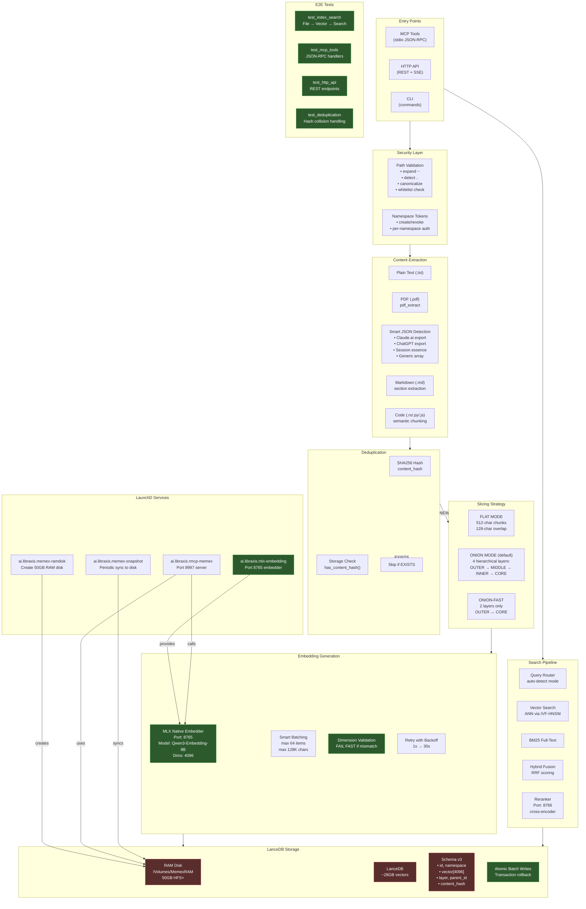

# Memex Architecture - PROMISED (Docelowa)

## Kluczowe założenia docelowej architektury

### 1. Embedding Layer
- **Dedykowany MLX embedder** na porcie **8765**
- Folder implementacji: `~/.ai-memories/mlx-embeddings/`
- Model: `Qwen3-Embedding-8B` (4096 dims)
- **NIE Ollama** - natywny MLX dla Dragona

### 2. RAM Disk Architecture
- 50GB RAM disk `/Volumes/MemexRAM`
- LanceDB (~28GB) całkowicie w RAM
- Snapshot daemon - periodic sync to `~/.ai-memories/lancedb`
- PathState dependency - memex startuje dopiero gdy RAM disk gotowy

### 3. Dimension Safety
- **Validation at startup** - sprawdzenie czy embedder zwraca 4096 dims
- **Fail fast** - crash jeśli mismatch, nie silent corruption

### 4. Atomic Writes
- Transaction boundaries na batch writes
- Rollback przy partial failures
- No ghost documents

### 5. E2E Test Coverage
- Full pipeline tests (index → embed → store → search → verify)
- MCP tool integration tests
- HTTP API endpoint tests
- Deduplication regression tests
